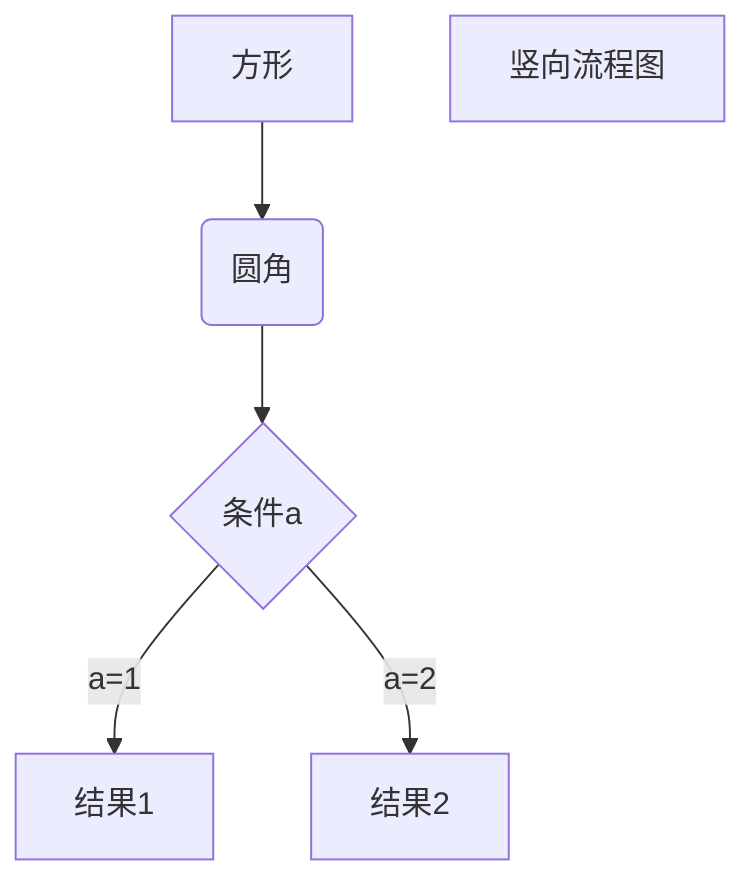

# Dispatcher framework
> 自动构建决策树，实现开闭原则
## 我们面临什么问题？
在我们项目中存在大量类似下面这样这样的代码：  

    public Object doExecute(String request){
        if(request=="1"){
            return "请求等于1，在这里处理";
        }else if(request=="2"){
            return "请求等于2，在这里处理";
        }else if(request=="3"){
            return "请求等于3，在这里处理";
        }
        
    }
    
上面这段代码存在什么问题呢？
* 最大的问题是代码写死了，如果不想要某类处理或者需要添加某种处理情况，就必须要在修改这个方法，在这个代码后面追加处理逻辑。
## 这个项目是如何解决这个问题的？
> 先定义几个概念

### 组/类（Group）

### 
## 如何使用？

