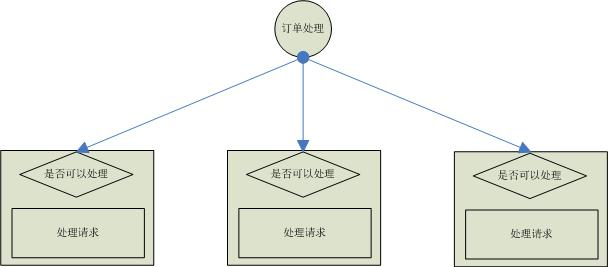
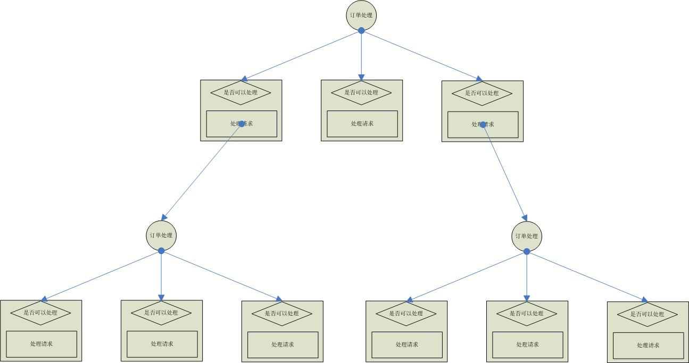

# Dispatcher framework
> 自动构建决策树，实现开闭原则
## 我们面临什么问题？
在我们项目中存在大量类似下面这样这样的代码：  

    public Object doExecute(String request){
        if(request=="1"){
            return "请求等于1，在这里处理";
        }else if(request=="2"){
            return "请求等于2，在这里处理";
        }else if(request=="3"){
            return "请求等于3，在这里处理";
        }
        
    }
    
上面这段代码存在什么问题呢？
* 最大的问题是代码写死了，如果不想要某类处理或者需要添加某种处理情况，就必须要在修改这个方法，在这个代码后面追加处理逻辑。
## 这个项目是如何解决这个问题的？
> 先把上面那段If-Else-If的代码画张图表示一下，再定义几个概念。

### 组/类（Group）
上面图中订单处理属于一个If-Else-If块，我们把这样一个代码块称为group，然后给每个group定义一个ID。
### 分发器（Dispatcher）
每个Group都对应一个Dispatcher，来对请求进行分发处理。
### 处理节点（Handler）
根据面向对象的职责划分，图中对每个处理节点是否能执行请求的判断，交由处理节点自己定义。
## 树
上面我们介绍的是单层级的If-Else-If块，如果If-Else-If存在嵌套，那么节后就是下面这样的：  

## 如何使用？
    
    IDispatcher<String> dispatcher = dispatcherFactory.createDispatcher("gender", String.class);
    Object result = dispatcher.doDispath("男");
    System.out.println(result);

